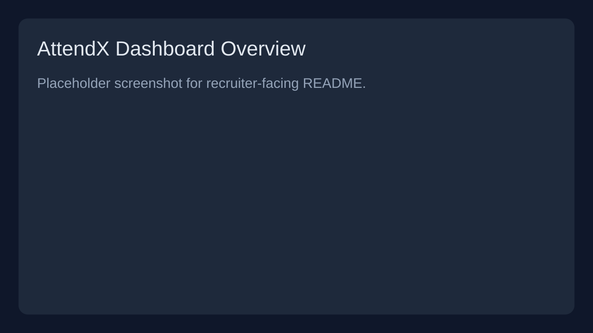
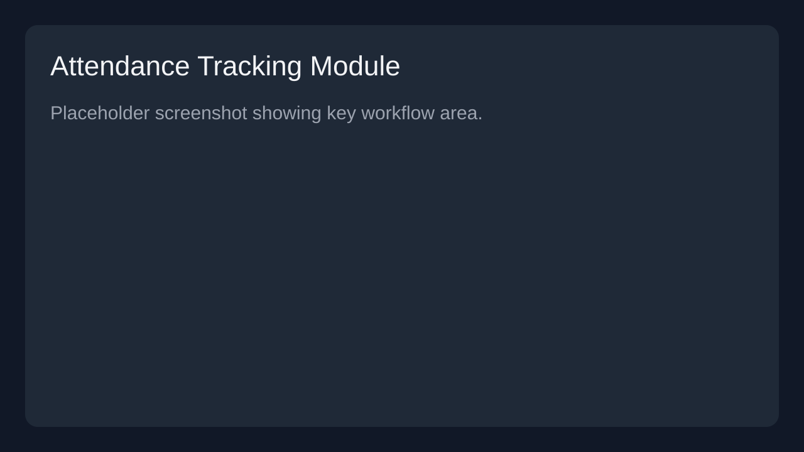

# 🎯 AttendX — AI-Powered Smart Attendance Management

> A full-stack attendance intelligence platform focused on automation, analytics, and recruiter-ready engineering quality.

[](./LICENSE)
[](https://github.com/arpitmishra6567/AttendX/stargazers)
[](https://github.com/arpitmishra6567/AttendX/commits)


🔗 **Quick Links**: [Live Demo](#-live-demo) • [Documentation](./docs/ARCHITECTURE.md) • [Getting Started](#-getting-started)

---

## ✨ Features

- 🤖 AI-assisted attendance workflows
- 🧑‍🎓 Student and faculty attendance tracking
- 📊 Real-time dashboard and analytical insights
- 🔐 Secure authentication and role-based access control
- 🧾 Attendance reporting and export-ready summaries
- ⚙️ Modular full-stack architecture for scalability

---

## 📸 Screenshots





---

## 🏗️ Architecture

AttendX follows a clean separation of responsibilities:

- **Frontend (`frontend/`)**: Next.js/React UI layer
- **Backend (`backend/`)**: Node.js/Express API layer
- **Database**: PostgreSQL for durable records and analytics

See [docs/ARCHITECTURE.md](./docs/ARCHITECTURE.md) for details.

---

## 💻 Tech Stack

### Frontend
- Next.js
- React
- TypeScript
- Tailwind CSS

### Backend
- Node.js
- Express
- PostgreSQL
- PL/pgSQL

### Tools
- Git & GitHub
- Docker (optional for deployment)

---

## 🚀 Getting Started

### Prerequisites
- Node.js 18+
- npm 9+
- PostgreSQL 14+

### Installation

```bash
git clone https://github.com/arpitmishra6567/AttendX.git
cd AttendX
```

### Development Setup

1. Copy environment template:
   ```bash
   cp .env.example .env
   ```
2. Fill required values in `.env`.
3. Install dependencies in each app folder once code is available:
   ```bash
   cd frontend && npm install
   cd ../backend && npm install
   ```

### Build & Deployment

```bash
# Example structure once app modules are present
cd frontend && npm run build
cd ../backend && npm run build
```

---

## 📝 Environment Variables

Use `.env.example` as the source of truth.

| Variable | Description |
|---|---|
| `NEXT_PUBLIC_API_URL` | Public URL for frontend API access |
| `DATABASE_URL` | PostgreSQL connection string |
| `API_KEY` | Internal service/API integration key |
| `JWT_SECRET` | Secret used to sign JWT tokens |

Template file: [`.env.example`](./.env.example)

---

## 🎮 Usage

```bash
# Development (example)
cd frontend && npm run dev
cd ../backend && npm run dev
```

```bash
# Production (example)
cd frontend && npm run start
cd ../backend && npm run start
```

> API endpoint documentation should be maintained under `docs/` as routes are finalized.

---

## 🗺️ Future Roadmap

- [ ] Face recognition-assisted attendance validation
- [ ] Multi-tenant institute management
- [ ] Mobile-first dashboard and push notifications
- [ ] ML-based absenteeism prediction and risk alerts
- [ ] Advanced admin analytics and custom report builder

---

## 🌐 Live Demo

Live deployment is currently being prepared. Add production URL here once deployed.

---

## 🤝 Contributing

Contributions are welcome. Open an issue first to discuss major changes.

1. Fork the repository
2. Create a feature branch
3. Commit your changes
4. Open a pull request

---

## 📄 License

Distributed under the MIT License. See [LICENSE](./LICENSE) for details.

---

## 👨‍💻 Author

**Arpit Mishra**

- GitHub: [@arpitmishra6567](https://github.com/arpitmishra6567)
- LinkedIn: [Arpit Mishra](https://www.linkedin.com/in/arpitmishra6567/)
- Email: arpitmishra6567@gmail.com

---

## 📞 Support

For support, feature requests, or bug reports, please open an issue:

➡️ [GitHub Issues](https://github.com/arpitmishra6567/AttendX/issues)
